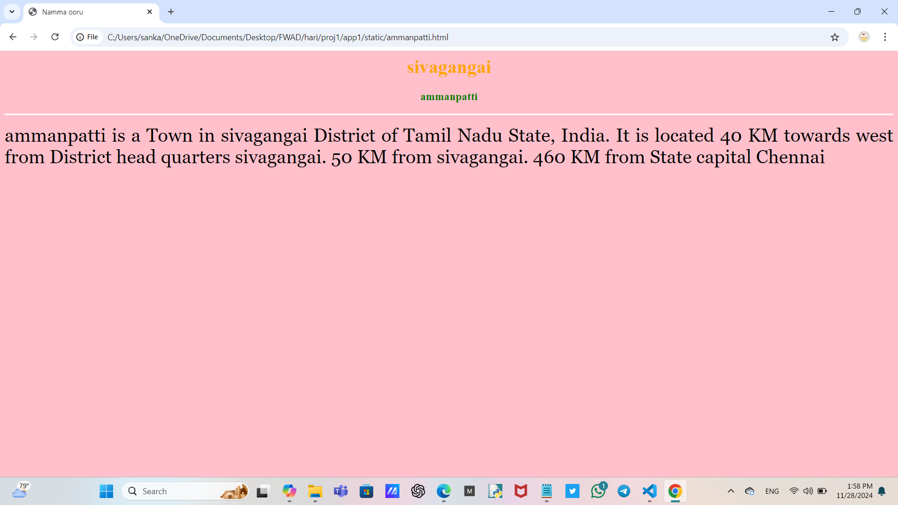
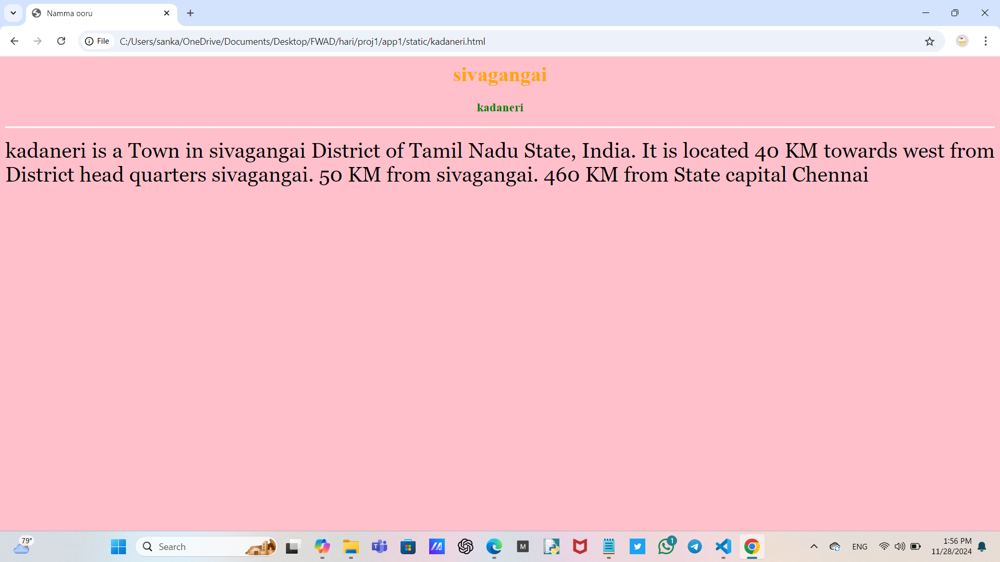
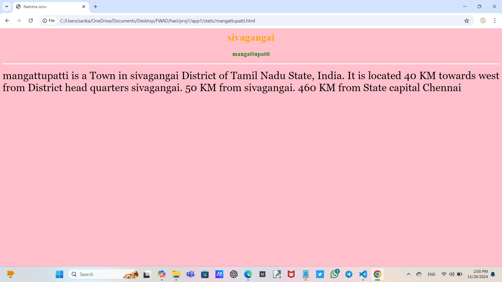
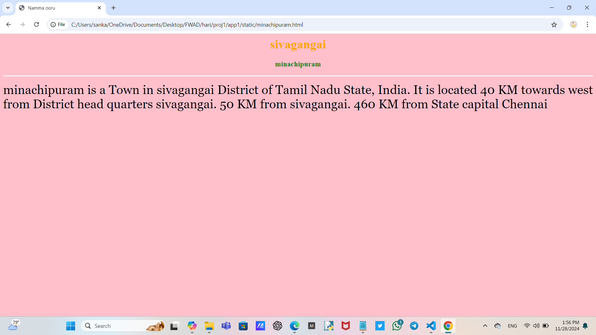
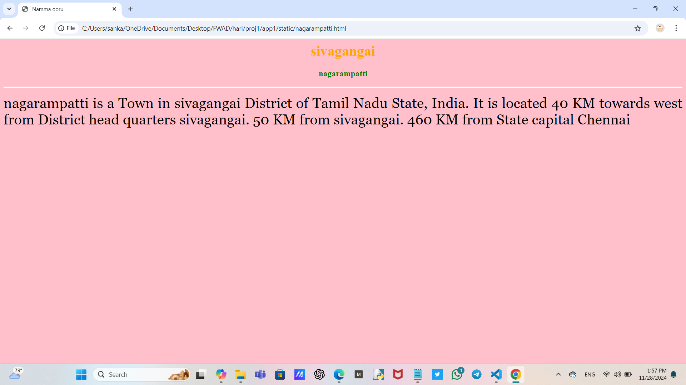

# Ex04 Places Around Me
## Date:28/11/24

## AIM
To develop a website to display details about the places around my house.

## DESIGN STEPS

### STEP 1
Create a Django admin interface.

### STEP 2
Download your city map from Google.

### STEP 3
Using ```<map>``` tag name the map.

### STEP 4
Create clickable regions in the image using ```<area>``` tag.

### STEP 5
Write HTML programs for all the regions identified.

### STEP 6
Execute the programs and publish them.

## CODE
```
<html>
<head>
<title>Welcome paganeri</title>
</head>
<body>
<h1 align="center">
<font color="blue"><b>PAGANERI</b></font>
</h1>
<h2 align="center">HARI PRASATH.P(24900112)</h2>

<center>


<map name="image-map">
    <area target="_self" alt="ammanpatti" title="kodaikanal" href="ammanpatti.html" coords="656,202,800,271" shape="rect">
    <area target="_self" alt="kadaneri" title="sirumalai" href="kadaneri.html" coords="190,556,343,640" shape="rect">
    <area target="_self" alt="mangattupatti" title="palani" href="mangattupatti.html" coords="977,511,1118,588" shape="rect">
    <area target="_self" alt="minachipuram" title="vattalagundu" href="minachipuram.html" coords="37,302,237,382" shape="rect">
    <area target="_self" alt="nagarampatti" title="natham" href="nagarampatti.html" coords="582,615,426,677" shape="rect">
</map>
</center>
</body>
</html>

<html>
<head>
<title>Namma ooru</title>
</head>
<body bgcolor="pink">
<h1 align="center">
<font color="orange"><b>sivagangai</b></font>
</h1>
<h3 align="center">
<font color="green">ammanpatti</b></font>
</h3>
<hr size="3" color="white">
<p align="justify">
<font face="Georgia" size="6">
    ammanpatti is a Town in sivagangai District of Tamil Nadu State, India.
     It is located 40 KM towards west from District head quarters sivagangai. 50 KM from sivagangai. 460 KM from State capital Chennai
</p>
</body>
</html>

<html>
<head>
<title>Namma ooru</title>
</head>
<body bgcolor="pink">
<h1 align="center">
<font color="orange"><b>sivagangai</b></font>
</h1>
<h3 align="center">
<font color="green">kadaneri</b></font>
</h3>
<hr size="3" color="white">
<p align="justify">
<font face="Georgia" size="6">
    kadaneri is a Town in sivagangai District of Tamil Nadu State, India.
     It is located 40 KM towards west from District head quarters sivagangai. 50 KM from sivagangai. 460 KM from State capital Chennai
</p>
</body>
</html>

<html>
<head>
<title>Namma ooru</title>
</head>
<body bgcolor="pink">
<h1 align="center">
<font color="orange"><b>sivagangai</b></font>
</h1>
<h3 align="center">
<font color="green">mangattupatti</b></font>
</h3>
<hr size="3" color="white">
<p align="justify">
<font face="Georgia" size="6">
    mangattupatti is a Town in sivagangai District of Tamil Nadu State, India.
     It is located 40 KM towards west from District head quarters sivagangai. 50 KM from sivagangai. 460 KM from State capital Chennai
</p>
</body>
</html>

<html>
<head>
<title>Namma ooru</title>
</head>
<body bgcolor="pink">
<h1 align="center">
<font color="orange"><b>sivagangai</b></font>
</h1>
<h3 align="center">
<font color="green">minachipuram</b></font>
</h3>
<hr size="3" color="white">
<p align="justify">
<font face="Georgia" size="6">
    minachipuram is a Town in sivagangai District of Tamil Nadu State, India.
     It is located 40 KM towards west from District head quarters sivagangai. 50 KM from sivagangai. 460 KM from State capital Chennai
</p>
</body>
</html>
<html>
<head>
<title>Namma ooru</title>
</head>
<body bgcolor="pink">
<h1 align="center">
<font color="orange"><b>sivagangai</b></font>
</h1>
<h3 align="center">
<font color="green">nagarampatti</b></font>
</h3>
<hr size="3" color="white">
<p align="justify">
<font face="Georgia" size="6">
    nagarampatti is a Town in sivagangai District of Tamil Nadu State, India.
     It is located 40 KM towards west from District head quarters sivagangai. 50 KM from sivagangai. 460 KM from State capital Chennai
</p>
</body>
</html>
```

## OUTPUT







## RESULT
The program for implementing image maps using HTML is executed successfully.
